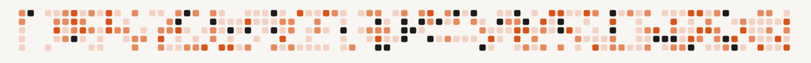

<!--
  Org profile README for github.com/the-ai-merge
  Palette from theaimerge.com: cream #F8F6F2, charcoal #1C1B19, terracotta #D95319.
  assets/header.svg and assets/footer.svg are hand-built — an animated grid of squares,
  styled like a GitHub contribution graph, sweeping left-to-right in brand colors.
  Self-hosted, no third-party generator. Bump the ?v= query after edits — raw.githubusercontent.com
  caches aggressively and won't otherwise pick up changes.
-->

  

 

The AI Merge helps software engineers build depth in modern AI engineering: models, agents, RAG, vision systems, inference, evals, monitoring, infrastructure, deployment, and AI-assisted engineering workflows.

This organization is the code side of it — reference implementations, walkthrough repos, and companion projects for what's covered on [theaimerge.com](https://theaimerge.com) and in [the newsletter](https://read.theaimerge.com), written by [Alex Razvant](https://github.com/arazvant).

 

### What's here

These repos focus on the engineering around AI systems — the parts that matter once a prototype has to work in a real product:

- How models behave inside applications
- How agents, tools, RAG, and multimodal systems are structured
- How inference, latency, deployment, and infrastructure affect product decisions
- How evals, monitoring, and reliability fit into the system
- How software engineers can use coding agents without losing ownership of the codebase

 

### Core areas

<table>
<tr><th align="left">Area</th><th align="left">What it covers</th></tr>
<tr><td><b>AI foundations</b></td><td>Model behavior, tokens, embeddings, attention, fine-tuning, hallucinations — the fundamentals before building on top of models.</td></tr>
<tr><td><b>AI systems</b></td><td>RAG, agents, tools, vision, speech, multimodal applications, workflows, APIs, product architecture.</td></tr>
<tr><td><b>Deployment &amp; infrastructure</b></td><td>Cloud, edge, containers, queues, runtimes, inference engines, GPUs, latency, memory, batching, quantization, cost tradeoffs.</td></tr>
<tr><td><b>Evaluation &amp; monitoring</b></td><td>Test sets, regressions, traces, feedback loops, confidence gates, observability, failure analysis.</td></tr>
<tr><td><b>AI-assisted engineering</b></td><td>Specs, coding agents, review loops, TDD, test harnesses — workflows that keep engineers in control of the codebase.</td></tr>
</table>

 

### Courses & larger projects

Built around complete AI systems, not isolated snippets.

<table>
<tr><th align="left">Project</th><th align="left">What it is</th><th align="left">Status</th></tr>
<tr>
<td><a href="https://github.com/the-ai-merge/multimodal-agents-course"><b>Kubrick</b></a></td>
<td>An open-source MCP multimodal AI agent course — built with Miguel Otero Pedrido.</td>
<td></td>
</tr>
<tr>
<td><b>The AI Atlas</b></td>
<td>A 220+ slide visual guide to the AI engineering field — diagrams, mental models, and system maps.</td>
<td><a href="https://theaimerge.com"><b>Join waitlist</b></a></td>
</tr>
<tr>
<td><b>MAVS</b></td>
<td>A full-stack wildlife monitoring AI system — MLOps, LLMOps, agents, multimodal workflows, edge AI inference.</td>
<td><a href="https://read.theaimerge.com"><b>Subscribe for updates</b></a></td>
</tr>
</table>

 

### Start here

<table>
<tr><th align="left">Where</th><th align="left">What you get</th></tr>
<tr><td><a href="https://theaimerge.com"><b>Website</b></a></td><td>The main hub for products, courses, visual guides, and current work.</td></tr>
<tr><td><a href="https://read.theaimerge.com"><b>Newsletter</b></a></td><td>Field notes, technical breakdowns, and essays on AI engineering systems.</td></tr>
<tr><td><a href="https://github.com/the-ai-merge"><b>Repositories</b></a></td><td>Reference code, examples, and implementation patterns.</td></tr>
</table>

 

  

